# How to Run the *Backend + DB* on your machine locally

---

## Step 1. Confirm configuration of Environment files and file integrity
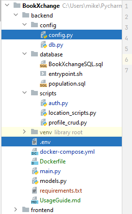

*`BookXchange/backend/config/config.py`* Is an environment file for python  
*`BookXchange/backend/.env`* Is an environment file for Docker

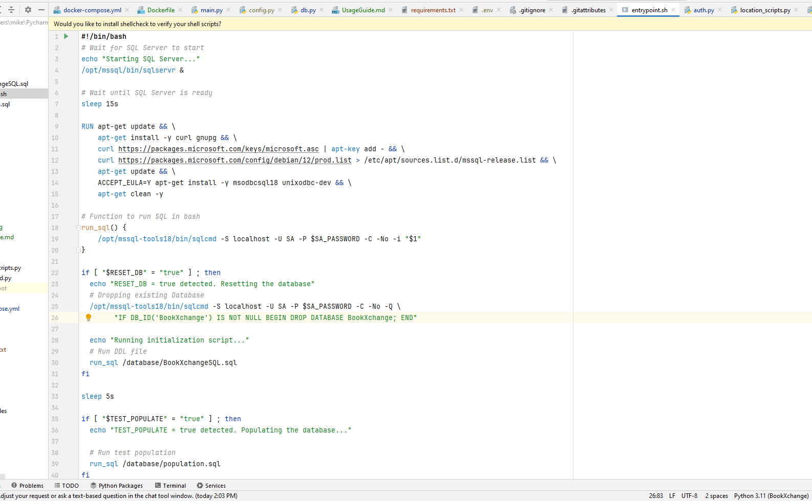
While having *`BookXchange/backend/database/entrypoint.sh`* open on the *Bottom-right* corner there is an *LF* field  
Stating line separation symbolics. Make sure that you have `LF` and *not* `CRLF`

## Step 2. Verify that url configuration is correct
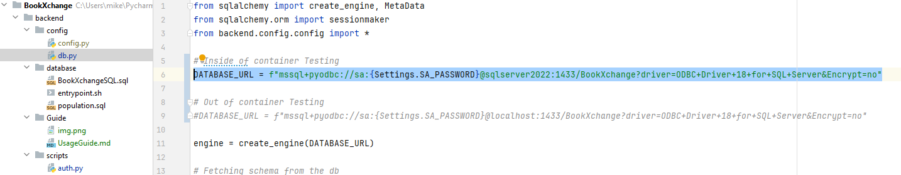

Inside of `BookXchange/backend/config/db.py` there is a line that on the comment says "Inside of container Testing"  
Corresponding line **must** be uncommented while the line that corresponds to "Out of container Testing" must be commented  
It has to look like the code shown on the picture

## Step 3. Run the Docker-Desktop application on your pc
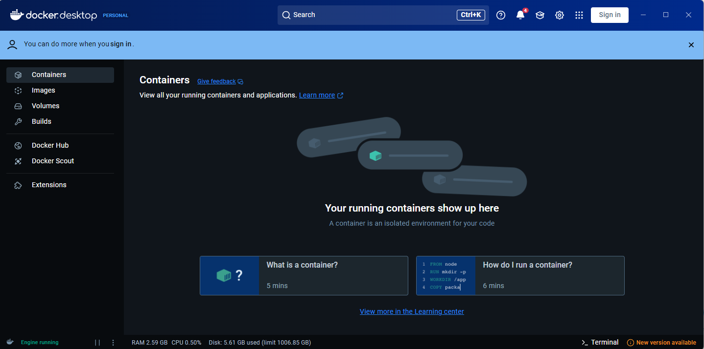
At the Bottom-left corner you must see **Engine Running** in green; otherwise you are not going to be able to run the docker

## Step 4. Open the Terminal and locate the directory
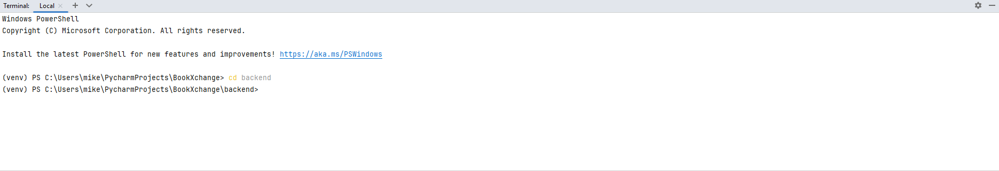
Open the terminal and using following commands you should get inside of *backend/* folder:
> `cd ..` - Move back the directory  
> `cd [name of the folder]` - Move into the directory by its name

Eventually your display path must look like following:
> `..[folder where you cloned repository into]\BookXchange\backend>`

## Step 5. Write command into the terminal and press *Enter*
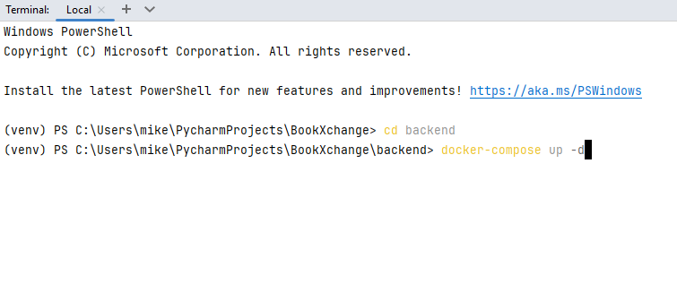
> `docker-compose up -d` - Is your command if you are on *Windows*  
> `docker compose up -d` - Is your command if you are on *MacOS or Linux*
> 
## Step 6. Wait
## It is going to take a while (10mins), because it needs to download images and compile layers

### Downloading of Images
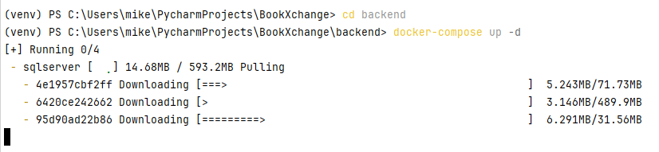

### Also downloading of images...
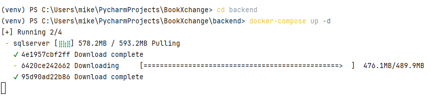

### Compiling layers
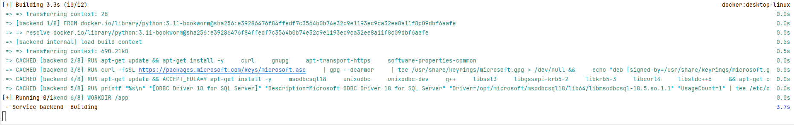

### Running containers one-by-one (SQL server has to be first one, and backend has to wait till it is fully ready)
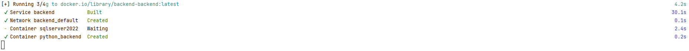

## Step 7. Verify that Containers are up
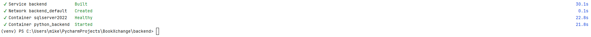
Eventually you will see same image on your computer

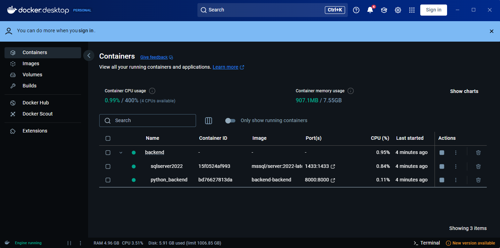
>You can also check containers through the docker app in the **Containers Tab** *(must be lit as green)*

## Step 8. Access the backend through a browser
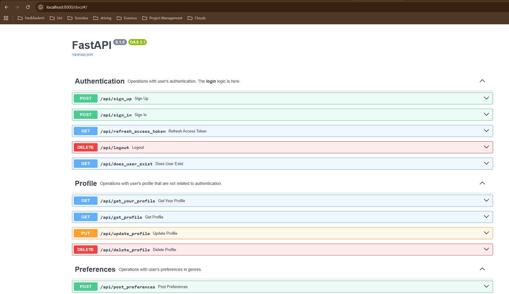
By writing `http://localhost:8000/docs#/` you should be able to access the swagger schema of the api

## Step 9. Endpoints
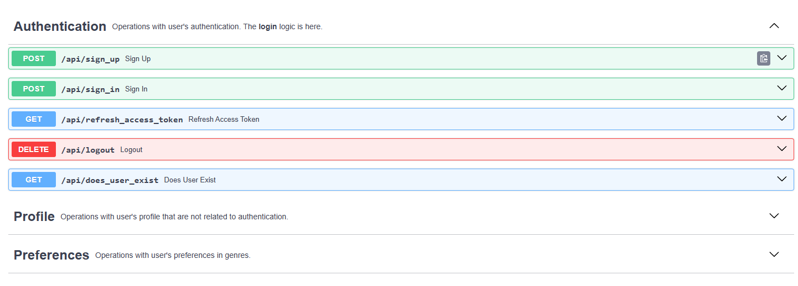
These are endpoints that are grouped by their goal
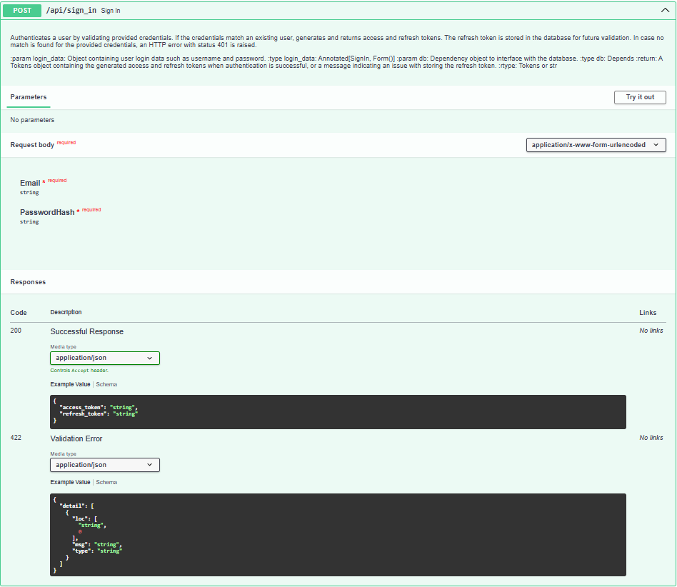
You can expand each of those and **test** by clicking the *Try it Out* button
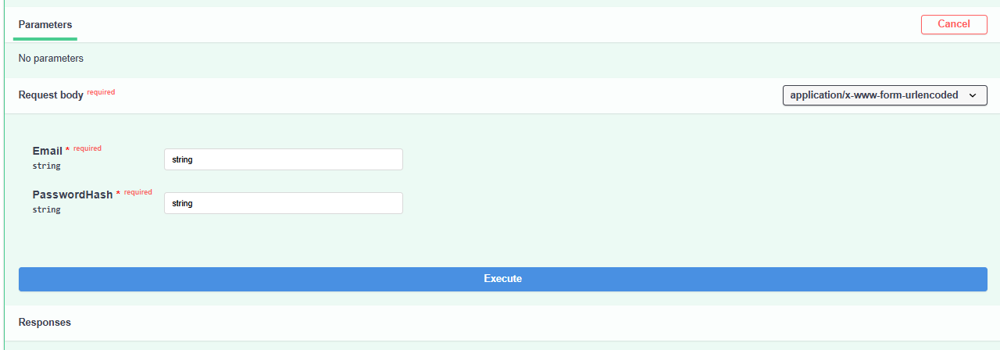
After clicking the button you will be able to insert data into input fields and click *Execute*
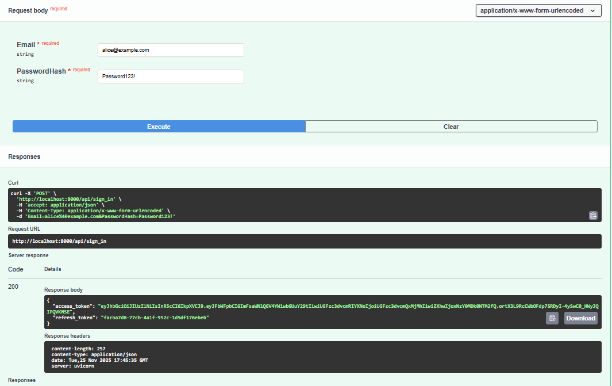
After successful execution you will see the desired response message

## Step 10. Schemas
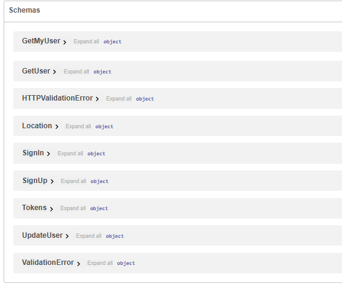
When developing you can go back to schemas to see the data model of both Inputs and Outputs that endpoind demand
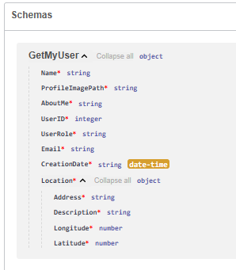